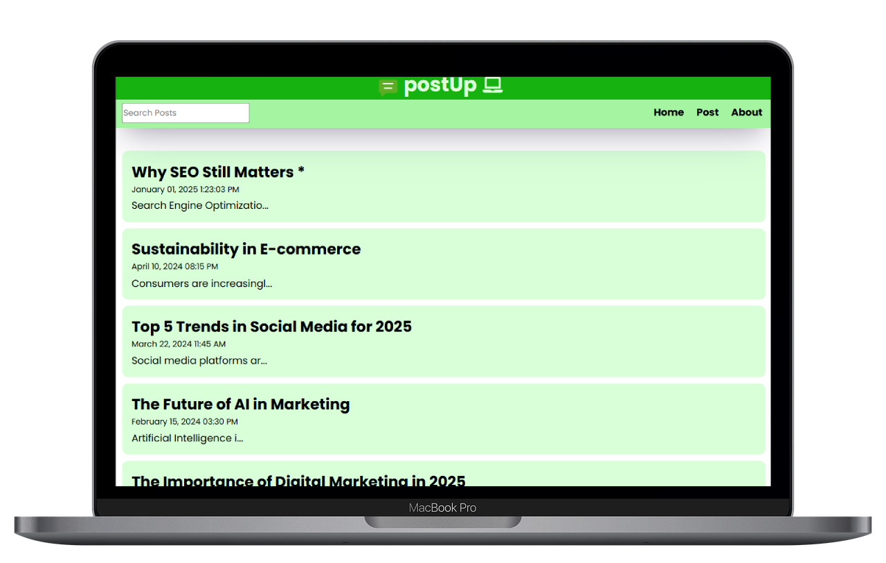

# 📝 PostUp – Message Posting Application

## 🔗 visit our site : [postUp](https://postup-reactapp.netlify.app/)

**PostUp** is a minimalist, responsive **message posting platform** built with **React.js**. It allows users to create, edit, and delete posts with real-time updates and automatic timestamps — all within a smooth, single-page application experience.

## 🚀 Key Features
- ✍️ **Create, Edit, Delete Posts** – Full CRUD functionality with intuitive form handling.
- 🕒 **Automatic Timestamps** – Every post is tagged with a live creation/edit time.
- 🔁 **Client-Side Routing** – Powered by **React Router** for seamless navigation.
- 🎨 **Responsive UI** – Designed with clean CSS to ensure usability across all devices.

## 🛠️ Tech Stack
- **React.js**
- **CSS**
- **React Router DOM**

## 💻 Preview

---

> *“Post it. Edit it. Manage it. PostUp makes message handling feel effortless.”* 💬
